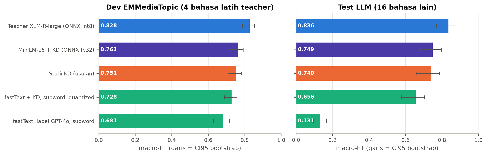
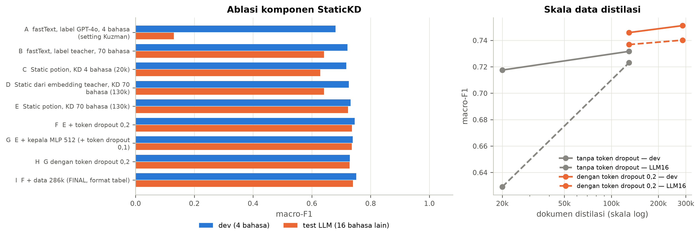
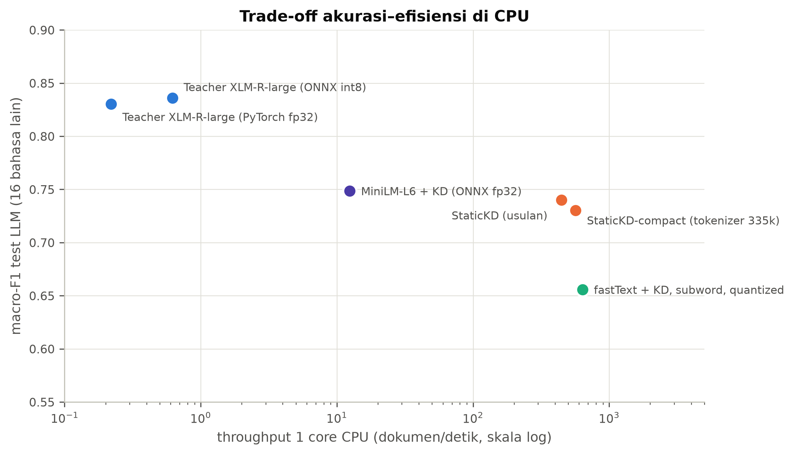
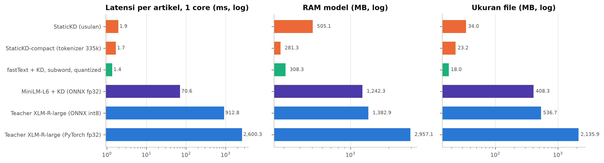
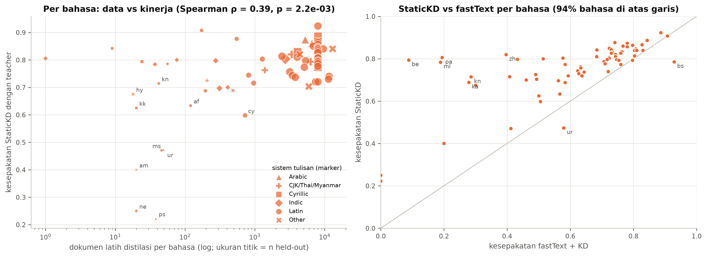
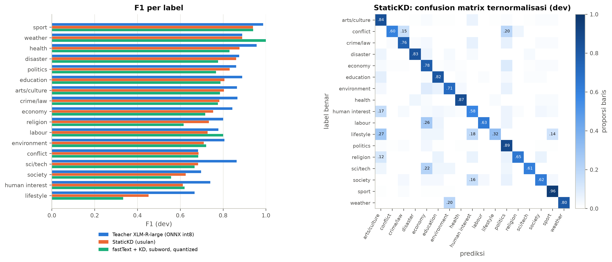
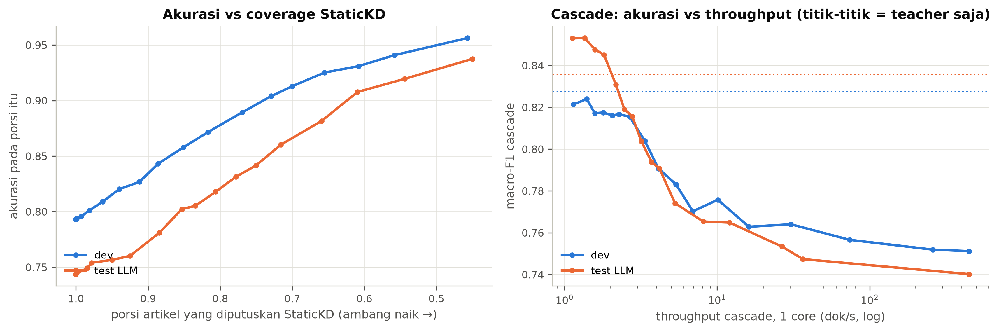

# StaticKD: Klasifikasi Topik Berita IPTC Multibahasa yang Ringan untuk CPU melalui Distilasi Pengetahuan ke Model *Static-Embedding*

**Obi Kastanya** (6025252015) dan **Ananta Dwi Prayoga Alwy** (6025252007)

---

**Abstrak** — Klasifikasi artikel berita ke dalam taksonomi IPTC Media Topic dibutuhkan industri analitik media untuk menyaring jutaan artikel per hari. Model terbaik yang tersedia secara terbuka, pengklasifikasi XLM-RoBERTa-large dari Kuzman dan Ljubešić (2025), akurat dan kuat lintas bahasa. Namun biaya komputasinya tidak pernah dilaporkan, dan pengukuran kami menunjukkan model ini membutuhkan 0,9–2,6 detik per artikel pada satu core CPU dengan memori 1,4–3,0 GB. Penelitian ini mengusulkan **StaticKD**, yaitu distilasi pengetahuan dari model tersebut (sebagai *teacher*) ke *student* berarsitektur *static embedding*: embedding token multibahasa pra-latih yang dirata-rata lalu dipetakan secara linear ke 17 kelas. Teacher melabeli 286 ribu artikel berita tak berlabel dari 70 bahasa. Student dilatih meminimalkan divergensi Kullback–Leibler terhadap distribusi teacher yang dilunakkan temperatur, dengan regularisasi *token dropout*. Karena kepala klasifikasinya linear, model akhir dapat dilipat menjadi tabel berisi 17 logit per token (34 MB) yang dijalankan hanya dengan NumPy. Evaluasi dilakukan pada data dev EMMediaTopic (4 bahasa, label GPT-4o), test set 320 artikel dari 16 bahasa di luar data latih teacher, dan 13.549 artikel *held-out* dari 70 bahasa. StaticKD mencapai macro-F1 0,751 dan 0,740 (91% dan 89% dari teacher) dengan latensi 1,9 ms per artikel dan throughput 447 artikel/detik per core CPU, sekitar **720× lebih cepat** dari versi CPU teroptimasi teacher (ONNX int8). StaticKD tidak berbeda signifikan dari student transformer MiniLM-L6 yang 36× lebih lambat, dan secara signifikan mengungguli fastText hasil distilasi yang sama pada bahasa-bahasa di luar data latih (+0,084 macro-F1). Analisis per bahasa menunjukkan bahwa kelemahan terutama ditentukan oleh jumlah data distilasi dan keyakinan teacher, bukan oleh sistem tulisan.

**Kata kunci** — klasifikasi topik berita, IPTC Media Topic, knowledge distillation, static embedding, klasifikasi teks multibahasa, efisiensi inferensi, CPU.

---

## I. PENDAHULUAN

Artikel berita adalah salah satu sumber informasi utama dalam industri data analitik karena sifatnya yang faktual dan terkini. Agar analisis tetap terarah, artikel perlu dikelompokkan ke kategori terstandar, lalu hanya topik yang relevan yang diproses lebih lanjut. International Press Telecommunications Council (IPTC) Media Topic adalah standar pengkategorian berita yang dipakai kantor berita besar seperti Reuters, Associated Press, dan Agence France-Presse [1], [8]. Level teratasnya terdiri dari 17 topik, antara lain *politics*, *economy, business and finance*, dan *sport*.

Kuzman dan Ljubešić [1] menunjukkan bahwa *large language model* (LLM) dapat menggantikan anotator manusia dalam membangun data latih klasifikasi IPTC. GPT-4o melabeli 20.000 artikel berita berbahasa Slovenia, Kroasia, Katalan, dan Yunani secara *zero-shot*, dengan kesepakatan terhadap manusia setara dengan kesepakatan antarmanusia. Label tersebut dipakai untuk melakukan *fine-tuning* XLM-RoBERTa-large [11], dan model yang dihasilkan (macro-F1 0,746 pada test set manusia) dirilis sebagai pengklasifikasi IPTC multibahasa terbuka pertama. Namun penelitian tersebut tidak mengukur dimensi efisiensi: jumlah parameter, ukuran model, memori, dan latensi inferensi. Padahal alasan utama mengganti GPT dengan model yang lebih kecil adalah kebutuhan memproses jutaan artikel per hari. Model berbasis XLM-RoBERTa-large dengan 560 juta parameter pada praktiknya menuntut GPU. Kebutuhan itu tidak terpenuhi oleh banyak pipeline produksi yang berjalan di server kecil berbasis CPU.

Kebutuhan praktis yang kami targetkan serupa dengan fastText *language identification* [10]: satu model kecil yang mengenali banyak bahasa dalam hitungan milidetik di CPU. Proposal awal penelitian ini mempertimbangkan kombinasi *knowledge distillation* (KD) dan *low-rank adaptation* (LoRA) [2], [6]. Akan tetapi LoRA hanya mengurangi jumlah parameter yang **dilatih**, bukan biaya **inferensi**: setelah adapter digabungkan, model tetap sebesar *backbone*-nya. Karena itu penelitian ini beralih ke pertanyaan yang lebih mendasar: **seberapa sederhana arsitektur student yang masih mampu meniru teacher IPTC multibahasa?**

Pertanyaan penelitian:
- **RQ1** — Seberapa akurat dan seberapa mahal (CPU) pengklasifikasi IPTC Kuzman dan Ljubešić bila dijalankan tanpa GPU?
- **RQ2** — Dapatkah pengetahuan teacher didistilasi ke model *static-embedding* secepat fastText tanpa kehilangan kemampuan multibahasa?
- **RQ3** — Komponen apa yang paling menentukan keberhasilan distilasi: sumber label, cakupan bahasa data, inisialisasi embedding, regularisasi, atau ukuran data?
- **RQ4** — Bagaimana trade-off akurasi–efisiensi dibanding baseline fastText dan student transformer kecil, dan apakah ada bahasa atau label yang sistematis lebih lemah?

Kontribusi penelitian ini:
1. **Laporan efisiensi pertama** pengklasifikasi IPTC Kuzman dan Ljubešić di CPU (latensi, throughput, memori, ukuran) dalam dua konfigurasi (PyTorch fp32 dan ONNX int8), dengan protokol benchmark yang dapat direproduksi untuk CPU *hybrid*.
2. **StaticKD**, resep distilasi teacher → *static multilingual embedding* untuk klasifikasi topik berita, yang menghasilkan model 34 MB dengan throughput ratusan artikel per detik per core, beserta **ablasi** kontribusi setiap komponen.
3. **Evaluasi lintas bahasa** pada 16 bahasa di luar data latih teacher (test set berlabel LLM dengan prompt Kuzman) dan 70 bahasa *held-out*, termasuk **analisis statistik faktor penentu kelemahan per bahasa**.
4. **Analisis kalibrasi dan mode cascade** student → teacher untuk kasus yang membutuhkan akurasi setara teacher.

---

## II. TINJAUAN PUSTAKA

### A. Klasifikasi topik berita berbasis IPTC
Dataset topik berita sebelumnya memakai skema sendiri, label yang tidak dianotasi manual, atau skema IPTC Subject Codes yang sudah usang [1]. Kuzman dan Ljubešić [1] membangun EMMediaTopic, 21.000 artikel dari korpus MaCoCu (diekstrak dengan pengklasifikasi genre X-GENRE [16]) yang dilabeli GPT-4o dengan 17 topik top-level IPTC Media Topic, beserta test set manusia 1.129 artikel. XLM-RoBERTa-large yang dilatih pada 15.000 artikel mencapai macro-F1 0,746, setara GPT-4o (0,731), dan model multibahasa tidak kalah dari model monolingual. Benchmark lanjutan mereka [18] menunjukkan pengklasifikasi ini bersaing dengan GPT-4o, GPT-5, dan Gemini 2.5, sedangkan baseline non-neural (TF-IDF + SVC) hanya mencapai macro-F1 0,42. Tidak satu pun studi tersebut melaporkan biaya inferensi.

### B. Parameter-efficient fine-tuning
Razuvayevskaya dkk. [3] membandingkan LoRA, adapter, dan *full fine-tuning* pada XLM-RoBERTa-large untuk klasifikasi berita multibahasa. PEFT memangkas parameter terlatih 140–280× dengan akurasi serupa. Azimi dkk. [6] menggabungkan KD dan LoRA (KD-LoRA) dan memperoleh 97% kinerja *full fine-tuning* dengan penurunan latensi 30% pada GLUE. Pengurangan latensi sebesar itu tidak cukup untuk kasus kami, yang membutuhkan penurunan dua sampai tiga orde besaran.

### C. Knowledge distillation dan model ringan
Di antara teknik kompresi model (pemangkasan, kuantisasi, distilasi, faktorisasi) [9], KD [4] melatih student untuk meniru distribusi probabilitas teacher yang dilunakkan dengan temperatur. Distribusi ini membawa informasi kemiripan antarkelas yang tidak ada pada label keras. Varian transformer kecil seperti DistilBERT [14] dan MiniLMv2 [12] mengurangi jumlah layer, tetapi tetap memerlukan perhatian (*attention*) atas seluruh token. Di sisi lain spektrum, fastText [10] adalah model *bag-of-n-gram* yang sangat cepat, tetapi embedding-nya dilatih dari nol sehingga tidak ada transfer lintas bahasa. Model2Vec [13] mendistilasi *sentence transformer* menjadi embedding token statis. Varian *potion-multilingual-128M* dilatih dari BGE-M3 [15] untuk 101 bahasa, sehingga kata-kata bermakna sama di bahasa berbeda memiliki vektor yang berdekatan. Piperno dkk. [5] menunjukkan distilasi efektif memindahkan pengetahuan antarbahasa, terutama ketika data bahasa target sedikit.

### D. Kesenjangan penelitian
(i) Pengklasifikasi IPTC yang ada tidak dievaluasi efisiensinya di CPU. (ii) Distilasi teacher transformer ke *static embedding* multibahasa belum diuji untuk klasifikasi topik berita dengan banyak kelas. (iii) Belum ada analisis sistematis mengenai bahasa mana yang lemah setelah model dikompresi dan mengapa. Temuan Ulčar dkk. [7] menunjukkan bahwa penurunan kinerja lintas bahasa bervariasi antartugas dan harus diukur langsung.

---

## III. METODOLOGI

### A. Kerangka umum
Gambar 1 merangkum pipeline StaticKD. Tahap pelabelan teacher dilakukan sekali secara *offline* (GPU dipakai hanya untuk mempercepat). Model produksi berjalan sepenuhnya di CPU.

```
 (offline, sekali)                                                     (produksi, CPU)
 CC-News 70 bahasa ──┐
 EMMediaTopic ───────┼─► Teacher XLM-R-large ─► soft label (17 logit) ─┐
                     │                                                  ▼
                     └────────────────────────────► Student: tokenizer ► embedding statis ► rata-rata ► linear
                                                     loss = τ²·KL(p_T ‖ p_S), τ = 2, token dropout 0,2
                                                                                         │ lipat W
                                                                                         ▼
                                                     Tabel |V| × 17 (fp16, 17 MB): ŷ = argmax(mean_i T[t_i] + b)
```
*Gambar 1. Pipeline StaticKD.*

### B. Data
**EMMediaTopic 1.0** [1]: 21.000 artikel (hr, sl, ca, el; 5.250 per bahasa), berlabel GPT-4o. Split `train` (20.000) dipakai untuk distilasi. Split `dev` (1.000) **tidak pernah dipakai melatih teacher maupun student** dan menjadi set evaluasi utama.

**Korpus CC-News multibahasa.** Diambil dari arsip Common Crawl News 2019–2021 yang dipisah per bahasa [17], dengan aturan berikut: (i) hanya dokumen yang bahasanya sama menurut metadata dan fastText-LID; (ii) judul + isi, minimal 75 kata (200 karakter untuk ja, zh, th, my), dipotong ke 512 kata, mengikuti praproses [1]; (iii) maksimal 150 dokumen per situs, karena arsip dikelompokkan per situs; (iv) **pemisahan held-out per domain**: seluruh dokumen dari sebagian situs disisihkan (≤ 20% per bahasa), sehingga evaluasi held-out mengukur generalisasi ke situs berita yang belum pernah dilihat. Hasilnya adalah 109.842 dokumen latih (69 bahasa) dan 13.549 dokumen held-out (68 bahasa). Untuk eksperimen skala data ditambahkan 156.157 dokumen (maks. 5.000 per bahasa, tidak pernah dari domain held-out), sehingga total data distilasi menjadi **285.999 dokumen**.

**Test set LLM 16 bahasa.** Terdiri dari 320 artikel held-out (20 per bahasa: en, de, fr, es, pt, it, ru, pl, tr, ar, zh, ja, id, vi, hi, sw) yang disebar merata antar situs. Semua bahasa ini **tidak ada** di data fine-tuning teacher. Artikel dianotasi oleh LLM (Claude) menggunakan prompt dan deskripsi label yang persis sama dengan yang dipakai Kuzman dan Ljubešić untuk GPT-4o [1, Lampiran B], tanpa akses ke prediksi model mana pun.

Test set manusia Kuzman (IPTC-test) tidak dipublikasikan dan hanya tersedia atas permintaan, sehingga tidak dipakai dalam penelitian ini (lihat Bagian VI).

*Tabel I. Ringkasan data.*

| Korpus | Dokumen | Bahasa | Label | Peran |
|---|---|---|---|---|
| EMMediaTopic train | 20.000 | 4 | GPT-4o + logit teacher | distilasi |
| EMMediaTopic dev | 1.000 | 4 | GPT-4o | evaluasi utama |
| CC-News train | 109.842 | 69 | logit teacher | distilasi |
| CC-News train tambahan | 156.157 | 50 | logit teacher | skala data |
| CC-News held-out (domain baru) | 13.549 | 68 | logit teacher | *fidelity* lintas bahasa |
| Test set LLM | 320 | 16 | LLM (prompt Kuzman) | generalisasi lintas bahasa |

### C. Teacher dan pelabelan distilasi
Teacher adalah `classla/multilingual-IPTC-news-topic-classifier` (XLM-RoBERTa-large, 559,9 juta parameter, maks. 512 token). Untuk setiap dokumen $d$ di korpus distilasi, teacher menghasilkan logit $\mathbf{z}^{T}(d)\in\mathbb{R}^{17}$ yang disimpan utuh. Pelabelan dijalankan dalam fp16 dengan *batch* yang diurutkan berdasarkan panjang teks, dengan kecepatan ±51 dokumen/detik pada GPU RTX 4050. Distribusi label teacher pada CC-News masuk akal (politics 15,6%, economy 13,0%, arts 11,3%, sport 10,5%; weather 1,2%), dan keyakinan rata-rata teacher per bahasa berkisar 0,88–0,98.

### D. Student StaticKD
**Arsitektur.** Dokumen $d$ ditokenisasi menjadi $t_1,\dots,t_n$ (tokenizer Unigram 500.353 token milik *potion-multilingual-128M* [13]; maks. 1.024 token). Setiap token memiliki embedding $\mathbf{e}_t\in\mathbb{R}^{256}$:
$$\mathbf{h}(d)=\frac{1}{n}\sum_{i=1}^{n}\mathbf{e}_{t_i},\qquad \mathbf{z}^{S}(d)=W\mathbf{h}(d)+\mathbf{b},\quad W\in\mathbb{R}^{17\times256}.$$

**Inisialisasi.** $E$ diambil dari potion-multilingual-128M, yaitu embedding statis 101 bahasa yang selaras lintas bahasa.

**Fungsi loss.** Dengan $p^{T}=\mathrm{softmax}(\mathbf{z}^{T}/\tau)$ dan $p^{S}=\mathrm{softmax}(\mathbf{z}^{S}/\tau)$:
$$\mathcal{L}_{KD}=\tau^{2}\,\mathrm{KL}\!\left(p^{T}\,\|\,p^{S}\right),\qquad \tau=2.$$
$E$, $W$, dan $\mathbf{b}$ dilatih *end-to-end*. $E$ memakai SparseAdam (lr $10^{-3}$), sehingga hanya baris token yang muncul di batch yang diperbarui. $W$ dan $\mathbf{b}$ memakai AdamW (lr $3\cdot10^{-3}$). Batch 64, 6 epoch.

**Token dropout.** Setiap token dokumen latih dibuang dengan probabilitas 0,2, sebagai augmentasi agar model tidak bergantung pada beberapa kata kunci.

**Pemilihan model.** Sebanyak 3% data latih disisihkan sebagai validasi internal, dengan metrik kesepakatan terhadap teacher. Set evaluasi tidak pernah dipakai untuk memilih hiperparameter.

**Pelipatan tabel.** Karena kepala linear,
$$W\Big(\tfrac{1}{n}\textstyle\sum_i\mathbf{e}_{t_i}\Big)=\tfrac{1}{n}\textstyle\sum_i T_{t_i},\qquad T=EW^{\top}\in\mathbb{R}^{|V|\times17}.$$
Model produksi hanyalah tabel $T$ dalam fp16 (17 MB) ditambah tokenizer. Inferensi = tokenisasi + rata-rata baris tabel + bias, tanpa perkalian matriks dan tanpa PyTorch.

**Varian compact.** Struktur internal tokenizer Unigram 500 ribu token membutuhkan ±490 MB RAM. Varian *compact* membuang potongan token yang muncul < 10 kali di korpus distilasi (karakter tunggal tetap dipertahankan), sehingga vocabulary menjadi 335.441 token.

### E. Baseline
1. **fastText** [10] (dim 100, bigram kata, lr 0,5, softmax), dalam empat varian: label GPT-4o EMMediaTopic saja (setting Kuzman, 4 bahasa) atau argmax teacher (70 bahasa), masing-masing dengan token kata atau subword SentencePiece XLM-R, ditambah varian terkuantisasi (`.ftz`).
2. **MiniLM-L6 + KD**: mMiniLMv2-L6-H384 yang didistilasi dari XLM-R-large [12], dengan loss KD yang sama (τ = 2), 2 epoch, lr $5\cdot10^{-5}$, maks. 256 token, diekspor ke ONNX fp32 dan int8 dinamis.
3. **Teacher**, dalam dua konfigurasi CPU: PyTorch fp32 (sesuai model card) dan ONNX int8 (ekspor onnx-community), yang merupakan konfigurasi CPU terbaik untuk teacher.

### F. Protokol evaluasi akurasi dan statistik
Metrik utama adalah **macro-F1** (seperti [1]), ditambah micro-F1 (= akurasi). Interval kepercayaan 95% dihitung dengan *bootstrap percentile* (1.000 resampling). Perbedaan dua model pada dokumen yang sama diuji dengan *paired bootstrap* (2.000 resampling) untuk Δmacro-F1 [19] dan uji McNemar eksak untuk akurasi [20], dengan koreksi Holm–Bonferroni [21] per set evaluasi. Validitas test set LLM diukur dengan Cohen's κ dan Krippendorff's α [22] antara anotator LLM dan teacher. Kalibrasi diukur dengan *Expected Calibration Error* (ECE, 15 bin) [23]. Analisis per bahasa memakai korelasi Spearman, uji Kruskal–Wallis, dan perbandingan $R^2$ regresi.

### G. Protokol efisiensi
Benchmark dijalankan **hanya di CPU** (GPU disembunyikan), satu model per proses baru. Jumlah thread dikunci pada seluruh pustaka (OMP, MKL, ONNX Runtime, `tokenizers`). **Latensi** diukur dengan 1 dokumen per panggilan (skenario *streaming*: mean, p50, p95). **Throughput** diukur dengan batch 64 (student ringan) atau 8 (transformer). **RAM model** adalah kenaikan RSS setelah model dimuat. Sampel teks adalah dokumen dev (median 220 kata). Perangkat keras: Intel Core Ultra 7 155H, 31 GB RAM, Windows 11. CPU ini *hybrid* (6 P-core, 8 E-core ±2,5× lebih lambat, 2 LP E-core ±3,7× lebih lambat). Tanpa *pinning*, sistem operasi memindahkan thread ke core lambat sehingga hasil multi-thread tidak stabil. Karena itu setiap proses dipin ke P-core fisik (1 core: CPU logis 0; 4 core: CPU logis 0, 10, 12, 14), untuk mensimulasikan server kecil dengan core seragam.

---

## IV. HASIL

### A. Review teacher (RQ1)
*Tabel II. Akurasi teacher.*

| Konfigurasi | Set | Macro-F1 [CI95] | Micro-F1 |
|---|---|---|---|
| PyTorch fp32 | dev (4 bahasa, label GPT-4o) | 0,820 [0,779–0,849] | 0,858 |
| PyTorch fp32 | test LLM (16 bahasa lain) | 0,830 [0,769–0,872] | 0,831 |
| ONNX int8 | dev | 0,828 [0,787–0,855] | 0,860 |
| ONNX int8 | test LLM | 0,836 [0,770–0,877] | 0,838 |

Skor dev lebih tinggi dari 0,746 pada paper asli karena labelnya berasal dari GPT-4o, yaitu label yang memang ditiru teacher. Teacher sangat kuat lintas bahasa: akurasi per bahasa pada test LLM berkisar 0,65 (hi, ru) hingga 1,00 (es, sw). Kesepakatan anotator LLM dengan teacher adalah 83,1% (κ = 0,815; α = 0,816, CI95 0,764–0,856), setara atau lebih tinggi dari kesepakatan antar dua anotator manusia pada paper Kuzman (α = 0,728). Hal ini menunjukkan test set LLM layak sebagai rujukan. Kebingungan utama teacher, yaitu *human interest* ↔ *arts, culture, entertainment and media* dan *society*/*economy* → *politics*, konsisten dengan [1].

*Tabel III. Efisiensi teacher di CPU (P-core terpin).*

| Konfigurasi | Core | Latensi p50 | Latensi p95 | Throughput | RAM model | Ukuran file |
|---|---|---|---|---|---|---|
| PyTorch fp32 | 1 | 2.600 ms | 4.415 ms | 0,22 dok/s | 2.957 MB | 2.136 MB |
| PyTorch fp32 | 4 | 1.083 ms | 1.710 ms | 0,59 dok/s | | |
| ONNX int8 | 1 | 913 ms | 1.942 ms | 0,62 dok/s | 1.383 MB | 537 MB |
| ONNX int8 | 4 | 329 ms | 527 ms | 2,08 dok/s | | |

**Jawaban RQ1.** Teacher akurat dan kuat lintas bahasa, tetapi untuk 1 juta artikel per hari (±11,6 artikel/detik) dibutuhkan ±18,7 core (ONNX int8) sampai ±52,6 core (PyTorch) khusus untuk klasifikasi. Biaya ini tidak layak untuk pipeline real-time di server kecil.

### B. Akurasi seluruh model (RQ2, RQ4)
*Tabel IV. Hasil utama. "Kesepakatan 70" = akurasi terhadap prediksi teacher pada held-out 70 bahasa.*

| Model | dev macro-F1 [CI95] | dev micro | LLM16 macro-F1 [CI95] | LLM16 micro | Kesepakatan 70 |
|---|---|---|---|---|---|
| Teacher (PyTorch fp32) | 0,820 [0,779–0,849] | 0,858 | 0,830 [0,769–0,872] | 0,831 | – |
| Teacher (ONNX int8) | 0,828 [0,787–0,855] | 0,860 | 0,836 [0,770–0,877] | 0,838 | – |
| MiniLM-L6 + KD (ONNX fp32) | 0,763 [0,718–0,792] | 0,801 | 0,749 [0,678–0,797] | 0,766 | 0,814 |
| MiniLM-L6 + KD (ONNX int8) | 0,633 [0,575–0,675] | 0,725 | 0,610 [0,523–0,668] | 0,669 | – |
| **StaticKD (usulan)** | **0,751 [0,708–0,783]** | **0,793** | **0,740 [0,659–0,787]** | **0,744** | **0,800** |
| StaticKD-compact | 0,751 [0,708–0,783] | 0,793 | 0,730 [0,647–0,776] | 0,738 | 0,789 |
| fastText + KD, subword, quantized | 0,728 [0,690–0,759] | 0,764 | 0,656 [0,577–0,705] | 0,669 | 0,698 |
| fastText + KD, subword | 0,721 [0,677–0,754] | 0,767 | 0,642 [0,567–0,692] | 0,675 | 0,701 |
| fastText + KD, kata | 0,717 [0,675–0,750] | 0,764 | 0,619 [0,540–0,668] | 0,666 | 0,711 |
| fastText, label GPT-4o, subword | 0,681 [0,628–0,717] | 0,734 | 0,131 [0,096–0,166] | 0,225 | – |
| fastText, label GPT-4o, kata | 0,652 [0,603–0,692] | 0,738 | 0,118 [0,076–0,155] | 0,222 | – |

StaticKD mempertahankan 90,7% macro-F1 teacher ONNX di dev dan 88,5% di 16 bahasa lain. Kuantisasi int8 dinamis tidak merugikan teacher, tetapi menurunkan MiniLM-L6 secara drastis (−0,130 macro-F1 dev), bahkan dengan kuantisasi *per-channel* yang hanya diterapkan pada operasi MatMul. Karena itu MiniLM dilaporkan dalam fp32.


*Gambar 2. Macro-F1 dengan interval kepercayaan 95% bootstrap pada dua set evaluasi berlabel.*

### C. Uji signifikansi
*Tabel V. Uji berpasangan StaticKD terhadap model lain (p dikoreksi Holm; b/c = jumlah dokumen yang hanya benar di StaticKD / hanya benar di model pembanding).*

| Set | StaticKD vs | Δ macro-F1 [CI95] | p bootstrap | Δ akurasi | McNemar b/c | p McNemar |
|---|---|---|---|---|---|---|
| dev | Teacher ONNX int8 | −0,076 [−0,109; −0,042] | < 0,001 | −0,067 | 50/117 | < 0,001 |
| dev | Teacher PyTorch | −0,069 [−0,103; −0,034] | < 0,001 | −0,065 | 47/112 | < 0,001 |
| dev | MiniLM-L6 + KD | −0,012 [−0,046; +0,026] | 1,000 | −0,008 | 79/87 | 0,743 |
| dev | fastText + KD (q) | +0,023 [−0,018; +0,063] | 0,786 | +0,029 | 83/54 | 0,049 |
| dev | fastText, GPT-4o | +0,070 [+0,029; +0,119] | < 0,001 | +0,059 | 122/63 | < 0,001 |
| dev | StaticKD 130k | +0,005 [−0,013; +0,023] | 1,000 | +0,007 | 26/19 | 0,743 |
| LLM16 | Teacher ONNX int8 | −0,096 [−0,171; −0,020] | 0,044 | −0,094 | 11/41 | < 0,001 |
| LLM16 | Teacher PyTorch | −0,090 [−0,170; −0,017] | 0,044 | −0,088 | 14/42 | 0,001 |
| LLM16 | MiniLM-L6 + KD | −0,008 [−0,079; +0,057] | 1,000 | −0,022 | 30/37 | 0,928 |
| LLM16 | fastText + KD (q) | +0,084 [+0,022; +0,148] | 0,040 | +0,075 | 41/17 | 0,007 |
| LLM16 | fastText, GPT-4o | +0,610 [+0,534; +0,662] | < 0,001 | +0,519 | 172/6 | < 0,001 |
| LLM16 | StaticKD 130k | +0,003 [−0,032; +0,037] | 1,000 | +0,003 | 10/9 | 1,000 |

Temuan utama: (i) StaticKD lebih rendah signifikan dari teacher. (ii) StaticKD **tidak berbeda signifikan dari MiniLM-L6 + KD** di kedua set. (iii) StaticKD **signifikan lebih baik dari fastText + KD pada 16 bahasa lain**, sedangkan pada 4 bahasa latih perbedaannya tidak signifikan. Jadi keunggulan StaticKD terutama terletak pada generalisasi lintas bahasa.

### D. Ablasi (RQ3)
*Tabel VI. Ablasi. Setiap baris mengubah satu faktor.*

| Kode | Varian | dev macro-F1 | LLM16 macro-F1 | Kesepakatan 70 |
|---|---|---|---|---|
| A | fastText, label GPT-4o, 4 bahasa (setting Kuzman) | 0,681 | 0,131 | – |
| B | fastText, label teacher, 70 bahasa | 0,721 | 0,642 | 0,701 |
| C | Static potion, KD 4 bahasa (20k) | 0,718 | 0,629 | – |
| D | Static dari embedding teacher, KD 70 bahasa (130k) | 0,726 | 0,642 | 0,748 |
| E | Static potion, KD 70 bahasa (130k) | 0,732 | 0,723 | 0,791 |
| F | E + token dropout 0,2 | 0,746 | 0,737 | 0,796 |
| G | E + kepala MLP 512 (+ token dropout 0,1) | 0,739 | 0,736 | 0,801 |
| H | G dengan token dropout 0,2 | 0,729 | 0,729 | 0,801 |
| J | F dilipat ke tabel fp16 | 0,746 | 0,737 | 0,796 |
| I | F + data 286k (**final**) | 0,751 | 0,740 | 0,800 |
| K | I + tokenizer dipangkas (min. 10) | 0,751 | 0,730 | 0,789 |
| L | I + tokenizer dipangkas (min. 50) | 0,749 | 0,714 | 0,773 |
| M | I, rata-rata 3 seed (± SD) | 0,750 ± 0,002 | 0,745 ± 0,016 | 0,800 ± 0,002 |
| N | Ensemble 3 seed (rata-rata tabel) | 0,753 | 0,722 | 0,803 |
| O | I + bigram hashing 2²¹ | 0,738 | 0,722 | 0,804 |
| P | I + bigram hashing 2²⁰ (lr lebih kecil) | 0,742 | 0,716 | 0,803 |
| Q | I dengan τ = 4 / τ = 0,5 | 0,724 / 0,747 | 0,704 / 0,743 | 0,792 / 0,807 |
| R | I + CE label GPT-4o / + bobot keyakinan teacher | 0,736 / 0,755 | 0,720 / 0,735 | 0,797 / 0,799 |
| S | I + pooling berbobot idf^0,5 / bobot token dipelajari | 0,748 / 0,742 | 0,737 / 0,715 | 0,801 / 0,801 |
| T | I dengan τ = 1, rata-rata 3 seed (± SD) | 0,755 ± 0,002 | 0,748 ± 0,015 | 0,808 ± 0,000 |
| **U** | **T, ensemble 3 seed (StaticKD v2)** | **0,761** | **0,745** | **0,811** |

Pembacaan ablasi:
- **Distilasi multibahasa adalah komponen terpenting** (A → B: +0,511 macro-F1 lintas bahasa). Tanpa data dari bahasa lain, model bag-of-words gagal total di luar 4 bahasa latih.
- **Embedding yang selaras lintas bahasa memberi transfer tanpa data bahasa target** (A → C: 0,131 → 0,629), dan gabungan keduanya adalah yang terbaik (E).
- **Embedding yang didistilasi dari encoder teacher** (D) kalah dari potion untuk lintas bahasa (0,642 vs 0,723). Representasi token tunggal dari encoder yang di-*fine-tune* ternyata kurang selaras antarbahasa.
- **Token dropout** memberi +0,014 (F), sedangkan kepala MLP tidak memberi tambahan (G, H) dan tidak bisa dilipat, sehingga ditolak.
- **Pelipatan tabel tidak mengubah prediksi** (J = F) sambil memperkecil model dari 128 MB (embedding int8) menjadi 34 MB.
- **Data ×2 hanya +0,005** (I; tidak signifikan, Tabel V). Kapasitas model bag-of-tokens sudah jenuh. Tiga seed berbeda (M) memberi simpangan baku 0,002 di dev tetapi 0,016 di test LLM (320 dokumen), sehingga selisih di bawah ±0,03 pada test LLM tidak dapat diinterpretasikan tanpa pengulangan seed.
- **Penambahan kapasitas yang tetap dapat dilipat tidak membantu.** Ensemble tiga seed (N) hanya memberi +0,003 dev dan kesepakatan (dalam batas noise). Bigram hashing (O, P) yaitu tabel 17 logit per pasangan token berurutan yang dilatih dari nol, menaikkan kesepakatan dengan teacher secara signifikan tetapi kecil (+0,004; paired bootstrap p = 0,02). Sebaliknya, akurasinya terhadap label independen turun (dev −0,013, p = 0,058; test LLM −0,018, n.s.), dan ukuran file naik 2–3×. Bigram tidak memiliki inisialisasi yang selaras lintas bahasa sehingga cenderung menghafal pola khas data distilasi.
- **Suhu distilasi adalah satu-satunya faktor yang konsisten** (Q, T). Menurunkan τ dari 2 ke 1 menaikkan dev +0,005 (Welch 3 vs 3 seed, p = 0,014) dan kesepakatan +0,008 (p = 0,007), tanpa perubahan di test LLM (p = 0,82). τ = 4 dan τ = 0,5 lebih buruk. Soft label yang lebih tajam cocok untuk student berkapasitas rendah, karena τ tinggi memaksa student meniru ekor distribusi teacher yang tidak mampu direpresentasikannya. Perubahan lain pada sinyal atau pooling (R, S), kalibrasi bias per kelas (5-fold CV di dev: 0,721), dan pemotongan input (512 token: test LLM 0,706) tidak membantu.
- **StaticKD v2** (U) menggabungkan τ = 1 dengan ensemble tabel 3 seed. Hasilnya dev 0,761 dan kesepakatan 0,811 (+0,011 terhadap I; paired bootstrap p < 0,001). Ukuran (34 MB), RAM, dan latensinya identik dengan I. Versi tokenizer ringkasnya (23 MB, ±281 MB RAM) mencapai 0,754 / 0,748 / 0,801, yaitu setara model I penuh. Kenaikan ini kecil dan tidak mengubah kesimpulan tentang batas atas student bag-of-tokens.


*Gambar 3. Ablasi komponen (kiri) dan skala data distilasi (kanan).*

### E. Efisiensi (RQ4)
*Tabel VII. Efisiensi CPU (P-core terpin). "4c" = 4 core.*

| Model | Latensi p50 / p95 (1c) | Throughput 1c | Throughput 4c | RAM model | Ukuran file | Dependensi |
|---|---|---|---|---|---|---|
| Teacher PyTorch fp32 | 2.600 / 4.415 ms | 0,22 dok/s | 0,59 dok/s | 2.957 MB | 2.136 MB | torch |
| Teacher ONNX int8 | 913 / 1.942 ms | 0,62 dok/s | 2,08 dok/s | 1.383 MB | 537 MB | onnxruntime |
| MiniLM-L6 + KD | 70,6 / 106,7 ms | 12,5 dok/s | 20,6 dok/s | 1.242 MB | 408 MB | onnxruntime |
| **StaticKD** | **1,94 / 6,31 ms** | **447 dok/s** | **1.683 dok/s** | 505 MB | **34 MB** | numpy, tokenizers |
| StaticKD-compact | 1,68 / 5,01 ms | 567 dok/s | 2.191 dok/s | 281 MB | 23 MB | numpy, tokenizers |
| fastText + KD (q) | 1,36 / 3,28 ms | 639 dok/s | 1.537 dok/s | 308 MB | 18 MB | fasttext, tokenizers |

StaticKD **720× lebih cepat** dari teacher ONNX int8 dan **2.030× lebih cepat** dari teacher PyTorch (throughput 1 core), serta 36× lebih cepat dari MiniLM-L6. Satu juta artikel per hari hanya membutuhkan ±0,03 core. Kecepatannya setara fastText, tetapi akurasi lintas bahasanya jauh lebih baik (Gambar 4). Pada StaticKD, ±490 MB dari 505 MB RAM adalah struktur tokenizer Unigram, sedangkan tabel modelnya hanya 19 MB. Pemangkasan tokenizer (varian compact) menurunkan RAM menjadi 281 MB dengan biaya −0,010 macro-F1 lintas bahasa.


*Gambar 4. Trade-off akurasi (macro-F1 16 bahasa lain) terhadap throughput 1 core CPU (skala log).*


*Gambar 5. Latensi per artikel, RAM model, dan ukuran file (skala log).*

### F. Analisis per bahasa (RQ4)
Kinerja per bahasa diukur sebagai kesepakatan StaticKD dengan teacher pada held-out, untuk 59 bahasa dengan ≥ 20 dokumen held-out.

*Tabel VIII. Faktor penentu kinerja per bahasa.*

| Uji | Statistik | p |
|---|---|---|
| Spearman: kesepakatan vs log(jumlah dokumen latih) | ρ = 0,391 | 0,002 |
| Spearman: kesepakatan vs jumlah situs latih | ρ = 0,349 | 0,007 |
| Spearman: kesepakatan vs keyakinan rata-rata teacher | ρ = 0,661 | < 0,001 |
| Kruskal–Wallis: kesepakatan antar sistem tulisan | H = 8,69 | 0,122 |
| $R^2$ regresi: log(data) saja / sistem tulisan saja / keduanya | 0,109 / 0,129 / 0,213 | – |

Rata-rata kesepakatan per sistem tulisan: Arab 0,867, Sirilik 0,830, Latin 0,790, CJK/Thai/Myanmar 0,775, Indik 0,770, lainnya 0,745. Temuannya adalah sebagai berikut.
1. **Jumlah data dan keragaman sumber berkorelasi positif dengan kinerja.** Kelima bahasa terlemah (ps 0,22; ne 0,25; am 0,40; ms 0,47; ur 0,47) semuanya memiliki < 50 dokumen latih.
2. **Sistem tulisan tidak berpengaruh signifikan.** Bahasa beraksara non-Latin dengan data cukup berkinerja baik (ar 0,86; ru 0,87; hi 0,80; zh 0,82). Ini berkat embedding yang selaras lintas bahasa. Sebaliknya, fastText + KD jatuh pada aksara non-Latin (be 0,06; pa 0,19; zh 0,41; ka 0,30), dan StaticKD lebih baik dari fastText di 94% bahasa.
3. **Keyakinan teacher adalah prediktor terkuat.** Pada bahasa tempat teacher sendiri ragu, student lebih sering berbeda, sehingga sebagian kelemahan adalah ketidakpastian teacher yang ikut tertiru.
4. **Anomali bahasa Turki.** Pada test LLM, akurasi bahasa Turki hanya 0,25 (teacher 0,65), padahal datanya cukup (±3.400 dokumen) dan kesepakatan held-out-nya 0,74. Dengan hanya 20 dokumen uji dan sumber berita yang homogen, kasus ini memerlukan investigasi lanjutan. Bahasa Indonesia berkinerja setara teacher (0,85 vs 0,85).


*Gambar 6. Kiri: kesepakatan per bahasa terhadap jumlah data latih (marker = sistem tulisan, ukuran = jumlah held-out). Kanan: StaticKD vs fastText per bahasa.*

### G. Analisis per label
Label tersulit bagi StaticKD (F1 dev) adalah *lifestyle and leisure* (0,452), *human interest* (0,612), *society* (0,625), dan *science and technology* (0,683). Label termudah adalah *sport* (0,940), *weather* (0,889), dan *health* (0,876). Pola ini sama dengan teacher (*lifestyle* 0,667, *society* 0,697, *human interest* 0,740) dan dengan kesepakatan antar anotator manusia yang dilaporkan [1], tetapi lebih tajam. Selisih terbesar terhadap teacher ada pada *lifestyle* (−0,215) dan *science and technology* (−0,181), dua label yang sangat bergantung pada konteks, bukan kata kunci. Pada data dev, terdapat 117 dokumen (11,7%) yang benar di teacher tetapi salah di StaticKD, dan 50 dokumen sebaliknya.


*Gambar 7. F1 per label (kiri) dan confusion matrix ternormalisasi StaticKD pada dev (kanan).*

### H. Kalibrasi dan mode cascade
Probabilitas StaticKD terkalibrasi baik pada bahasa latih (ECE 0,047) dan cukup baik pada 16 bahasa lain (ECE 0,107, cenderung *overconfident*). Hal ini memungkinkan mode **cascade**: artikel dengan confidence ≥ θ diputuskan StaticKD, sisanya dikirim ke teacher.

*Tabel IX. Cascade StaticKD → teacher ONNX int8 (throughput efektif 1 core).*

| θ | Porsi StaticKD (dev) | Akurasi porsi itu | Cascade micro-F1 dev | Cascade macro-F1 LLM16 | Throughput |
|---|---|---|---|---|---|
| 0 (StaticKD saja) | 100% | 0,793 | 0,793 | 0,740 | 447 dok/s |
| 0,6 | 81,7% | 0,871 | 0,840 | 0,804 | 3,4 dok/s |
| 0,7 | 72,9% | 0,904 | 0,852 | 0,819 | 2,3 dok/s |
| 0,8 | 65,5% | 0,925 | 0,854 | 0,845 | 1,8 dok/s |
| teacher saja | 0% | – | 0,860 | 0,836 | 0,62 dok/s |

Dengan θ = 0,8, StaticKD memutuskan dua pertiga artikel dengan akurasi 92,5%, dan cascade mencapai akurasi setara teacher dengan beban teacher tinggal ±34%. Throughput-nya tetap dibatasi teacher, sehingga cascade cocok untuk jalur *batch*, bukan real-time.


*Gambar 8. Akurasi terhadap coverage StaticKD (kiri) dan akurasi cascade terhadap throughput (kanan; garis titik = teacher saja).*

---

## V. PEMBAHASAN

**RQ2: distilasi ke model static-embedding berhasil.** Model yang secara komputasi setara fastText mempertahankan ±90% kinerja teacher, baik pada bahasa latih maupun 16 bahasa yang tidak pernah dilihat teacher saat *fine-tuning*. Dua faktor saling melengkapi. Pertama, teacher yang kuat lintas bahasa dapat melabeli data berita dalam bahasa apa pun secara gratis, sehingga keterbatasan data berlabel Kuzman (4 bahasa) dapat diatasi. Kedua, embedding statis yang selaras lintas bahasa memungkinkan pengetahuan dari bahasa kaya data berpindah ke bahasa lain. Faktor kedua inilah yang tidak dimiliki fastText.

**Mengapa model bag-of-tokens cukup?** Topik berita sebagian besar ditentukan oleh kosakata (nama lembaga, istilah olahraga, istilah medis). Hal ini berbeda dari tugas yang sangat bergantung pada urutan dan konteks, seperti sentimen, sarkasme, atau inferensi. Konteks penuh transformer 6 layer hanya menambah 0,9–1,2 poin yang tidak signifikan, dengan biaya 36× lebih lambat. Batas bawah kesalahan StaticKD ada pada label yang ambigu bahkan bagi manusia (*lifestyle*, *human interest*, *society*), di mana informasi konteks lebih berperan.

**Posisi terhadap proposal KD + LoRA.** LoRA [2], [3] menurunkan biaya *training*, sedangkan masalah yang dihadapi adalah biaya *inferensi*. KD ke transformer kecil (setara KD-LoRA [6] tanpa adapter) memang mempercepat inferensi sekitar satu orde besaran (MiniLM: 12,5 dok/s), tetapi masih dua orde lebih lambat dari StaticKD dengan akurasi yang tidak berbeda signifikan. Selain itu, model transformer kecil ini rentan terhadap kuantisasi int8, sedangkan StaticKD tidak memerlukan kuantisasi agresif karena biaya inferensinya sudah sangat rendah. Research gap mengenai efisiensi model IPTC yang diangkat dalam proposal dijawab langsung oleh Tabel III dan VII.

**Implikasi praktis.** Untuk pipeline real-time di server tanpa GPU, StaticKD dapat menggantikan teacher dengan biaya ±0,03 core per satu juta artikel per hari, file 23–34 MB, dan hanya bergantung pada `numpy` dan `tokenizers`. Untuk bahasa target yang lemah, solusi termurah adalah menambah berita bahasa tersebut dan melabelinya dengan teacher, tanpa mengubah arsitektur. Bila dibutuhkan akurasi setara teacher, mode cascade memberikan titik tengah yang terkontrol melalui satu parameter θ.

---

## VI. KETERBATASAN

1. **Tidak ada evaluasi pada test set manusia.** Data dev berlabel GPT-4o dan test set 16 bahasa berlabel LLM (satu anotator, 20 dokumen per bahasa, CI lebar). Evaluasi pada IPTC-test (1.129 dokumen berlabel manusia, tersedia atas permintaan ke penulis [1]) adalah langkah validasi berikutnya.
2. **Anotator test set LLM** adalah Claude. Anotasi dilakukan tanpa akses ke prediksi model dan memakai prompt Kuzman, dan kesepakatannya dengan teacher setara dengan kesepakatan antar manusia. Meski demikian, validasi manusia pada sampel tetap diperlukan.
3. **Batas atas student adalah teacher.** Bias dan kesalahan teacher ikut tertiru. Kesepakatan 70 bahasa mengukur *fidelity* terhadap teacher, bukan kebenaran absolut.
4. **Benchmark dilakukan pada satu perangkat** (laptop dengan CPU hybrid yang dipin ke P-core). Angka absolut di server berbeda, tetapi rasio antarmodel tetap informatif.
5. **Cakupan bahasa bergantung pada ketersediaan berita di CC-News.** Bahasa dengan data sangat sedikit (ps, ne, am, ur, ms) masih lemah.

---

## VII. KESIMPULAN

Penelitian ini mengukur untuk pertama kalinya biaya CPU pengklasifikasi IPTC multibahasa Kuzman dan Ljubešić: 0,9–2,6 detik per artikel per core, sehingga tidak layak untuk pipeline real-time tanpa GPU. Kami mengusulkan StaticKD, distilasi teacher ke model *static-embedding* multibahasa yang dilatih dengan KL-divergence pada 286 ribu artikel dari 70 bahasa, lalu dilipat menjadi tabel 17 logit per token. StaticKD mencapai macro-F1 0,751 (4 bahasa latih) dan 0,740 (16 bahasa lain), yaitu ±90% kinerja teacher, dengan latensi 1,9 ms dan throughput 447 artikel/detik per core. Angka ini ±720× lebih cepat dari teacher teroptimasi, dengan model 34 MB tanpa PyTorch. Ablasi menunjukkan bahwa kunci keberhasilannya adalah kombinasi distilasi pada data multibahasa dan inisialisasi embedding yang selaras lintas bahasa. Analisis per bahasa menunjukkan bahwa kelemahan ditentukan oleh jumlah data dan ketidakpastian teacher, bukan oleh sistem tulisan. Penelitian lanjutan mencakup evaluasi pada test set manusia, penambahan data untuk bahasa lemah, perluasan ke label IPTC level-2 secara hierarkis, dan pemanfaatan probabilitas terkalibrasi untuk klasifikasi multi-label.

---

## KETERSEDIAAN KODE DAN DATA

Seluruh kode (pengumpulan data, pelabelan teacher, training, evaluasi, benchmark, analisis) tersedia di folder `code/` dan notebook Google Colab `notebooks/IPTC_StaticKD_Colab.ipynb`. Notebook tersebut mereproduksi semua tabel dan gambar dari *bundle* hasil (`notebooks/iptc_statickd_bundle.zip`) atau menjalankan ulang seluruh pipeline. EMMediaTopic tersedia di CLARIN.SI (hdl.handle.net/11356/1991), dan CC-News multibahasa tersedia di Hugging Face (`CloverSearch/cc-news-mutlilingual`).

---

## REFERENSI

[1] T. Kuzman and N. Ljubešić, "LLM teacher-student framework for text classification with no manually annotated data: A case study in IPTC news topic classification," *IEEE Access*, vol. 13, pp. 35621–35633, 2025, doi: 10.1109/ACCESS.2025.3544814.

[2] E. J. Hu et al., "LoRA: Low-rank adaptation of large language models," in *Proc. Int. Conf. Learning Representations (ICLR)*, 2022.

[3] O. Razuvayevskaya et al., "Comparison between parameter-efficient techniques and full fine-tuning: A case study on multilingual news article classification," *PLOS ONE*, vol. 19, no. 5, 2024, doi: 10.1371/journal.pone.0301738.

[4] G. Hinton, O. Vinyals, and J. Dean, "Distilling the knowledge in a neural network," in *NIPS Deep Learning and Representation Learning Workshop*, 2015, arXiv:1503.02531.

[5] R. Piperno, L. Bacco, F. Dell'Orletta, M. Merone, and L. Pecchia, "Cross-lingual distillation for domain knowledge transfer with sentence transformers," *Knowledge-Based Systems*, vol. 311, art. no. 113079, 2025, doi: 10.1016/j.knosys.2025.113079.

[6] R. Azimi, R. Rishav, M. Teichmann, and S. Ebrahimi Kahou, "KD-LoRA: A hybrid approach to efficient fine-tuning with LoRA and knowledge distillation," in *Proc. 4th NeurIPS Efficient Natural Language and Speech Processing Workshop*, PMLR vol. 262, 2024, pp. 73–80.

[7] M. Ulčar et al., "Mono- and cross-lingual evaluation of representation language models on less-resourced languages," *Computer Speech & Language*, 2025, doi: 10.1016/j.csl.2025.101852.

[8] International Press Telecommunications Council (IPTC), "Media topics — IPTC NewsCodes," 2024. [Online]. Available: https://iptc.org/standards/media-topics/

[9] X. Zhu, J. Li, Y. Liu, C. Ma, and W. Wang, "A survey on model compression for large language models," *Transactions of the Association for Computational Linguistics*, 2024.

[10] A. Joulin, E. Grave, P. Bojanowski, and T. Mikolov, "Bag of tricks for efficient text classification," in *Proc. 15th Conf. European Chapter of the ACL (EACL)*, 2017, pp. 427–431.

[11] A. Conneau et al., "Unsupervised cross-lingual representation learning at scale," in *Proc. 58th Annu. Meeting of the ACL*, 2020, pp. 8440–8451.

[12] W. Wang, H. Bao, S. Huang, L. Dong, and F. Wei, "MiniLMv2: Multi-head self-attention relation distillation for compressing pretrained transformers," in *Findings of ACL-IJCNLP*, 2021, pp. 2140–2151.

[13] S. Tulkens and T. van Dongen, "Model2Vec: Fast state-of-the-art static embeddings," 2024. [Online]. Available: https://github.com/MinishLab/model2vec

[14] V. Sanh, L. Debut, J. Chaumond, and T. Wolf, "DistilBERT, a distilled version of BERT: Smaller, faster, cheaper and lighter," arXiv:1910.01108, 2019.

[15] J. Chen, S. Xiao, P. Zhang, K. Luo, D. Lian, and Z. Liu, "M3-Embedding: Multi-linguality, multi-functionality, multi-granularity text embeddings through self-knowledge distillation," in *Findings of ACL*, 2024.

[16] T. Kuzman, I. Mozetič, and N. Ljubešić, "Automatic genre identification for robust enrichment of massive text collections: Investigation of classification methods in the era of large language models," *Machine Learning and Knowledge Extraction*, vol. 5, no. 3, pp. 1149–1175, 2023.

[17] CloverSearch, "cc-news-mutlilingual: Common Crawl News split by language and year," Hugging Face Datasets. [Online]. Available: https://huggingface.co/datasets/CloverSearch/cc-news-mutlilingual

[18] T. Kuzman et al., "State of the art in text classification for South Slavic languages: Fine-tuning or prompting?," arXiv:2511.07989, 2025.

[19] P. Koehn, "Statistical significance tests for machine translation evaluation," in *Proc. Conf. Empirical Methods in Natural Language Processing (EMNLP)*, 2004, pp. 388–395.

[20] Q. McNemar, "Note on the sampling error of the difference between correlated proportions or percentages," *Psychometrika*, vol. 12, no. 2, pp. 153–157, 1947.

[21] S. Holm, "A simple sequentially rejective multiple test procedure," *Scandinavian Journal of Statistics*, vol. 6, no. 2, pp. 65–70, 1979.

[22] K. Krippendorff, *Content Analysis: An Introduction to Its Methodology*, 4th ed. Thousand Oaks, CA, USA: SAGE, 2018.

[23] C. Guo, G. Pleiss, Y. Sun, and K. Q. Weinberger, "On calibration of modern neural networks," in *Proc. 34th Int. Conf. Machine Learning (ICML)*, 2017, pp. 1321–1330.
